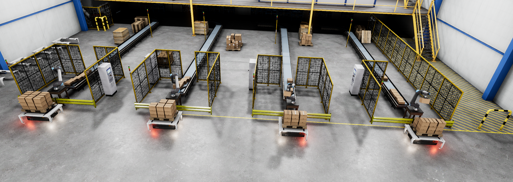
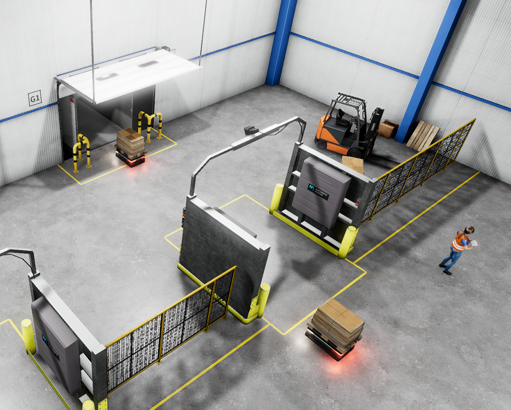
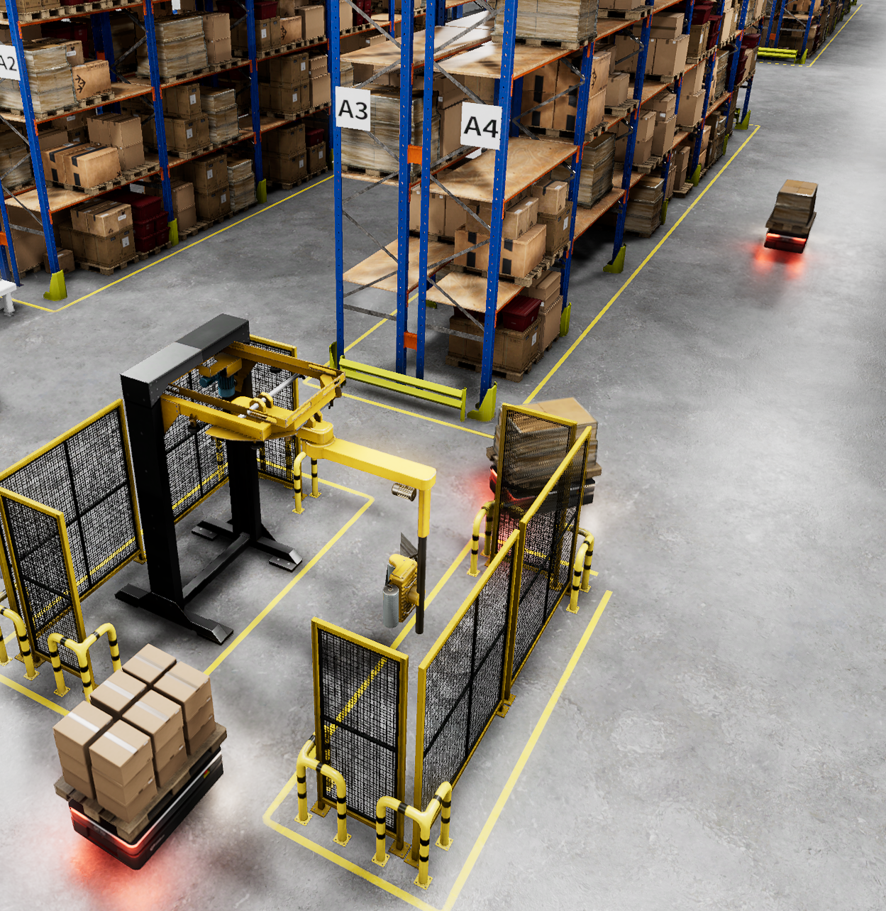
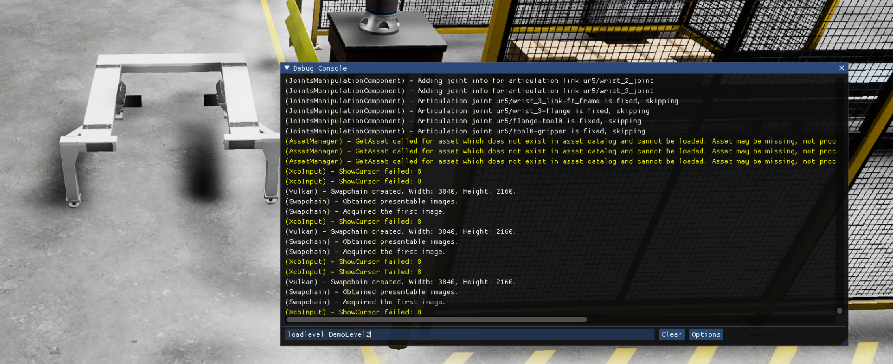

# Robotized fulfillment center

An [Open 3D Engine (O3DE)]((https://www.o3de.org/)) multi-robot demo.

## The project

This project demonstrates O3DE use for a complex robotic simulation through integration with modern ROS 2 stacks: nav2 and MoveIt2.
You can learn more about the features of O3DE for robotics and how to get started in [O3DE documentation](https://www.docs.o3de.org/docs/user-guide/interactivity/).

### Levels

- **DemoLevel1**: 30x100 meters scene with 4 conveyor belts, and 4 robotic arms. Suitable for 4-8 AMRs.
- **DemoLevel2**: 90x100 meters, three times larger, and 12 robotic arms, suitable for 12-24 AMRs.
- **RobotsSuperShot**: a level showcasing 3D models, with several different robots, a human, and a forklift. Some robots are not equipped with components yet, but you are welcome to try and make them work!
- **RobotImportLevel**: a small enclosed space with a table, good for [importing your own robot](https://docs.o3de.org/docs/user-guide/interactivity/robotics/importing-robot/).

### Detailed description

UR20 robot arms controlled by MoveIt2 with [pilz_industrial_motion_planner](https://moveit.picknik.ai/humble/doc/examples/pilz_industrial_motion_planner/pilz_industrial_motion_planner.html?highlight=pilz#pilz-industrial-motion-planner).
Boxes are supplied by conveyor belts, which are implemented through spawning when below a certain number in an area.
UR20 arms are placing boxes based on a ground truth vision system, which means they look at the scene and that there is no error in pose measurement.
UR20 arms start working as soon as an immobile pallet is detected in their load area and will load a configurable number of boxes (up to 18, by default 18) on each pallet.

Pallets are moved around by robots modeled after OTTO 600.
Note that these AMRs do not use the software of real OTTO 600 and do not have the same sensors.
They can navigate thanks to front/back lidar and operate cargo lifts.
OTTO 600 robots have assigned task loops, which are loading, wrapping, and delivering cargo to the other end of the warehouse.
They use a nav2 action server to realize their paths, and also a custom path follow solution for docking and unloading (for simplicity).
Note that robots follow their task independently but see and avoid each other.

In the warehouse, you can also notice some humans walking around.
Note that they don't see robots, as they use navigation through a Gem and only consider static scene objects.

### How does it look like





### The project includes
- **Scenery** initially created using a [Warehouse project template](https://www.docs.o3de.org/docs/user-guide/interactivity/robotics/project-configuration/#ros-2-project-templates), but many new models have been added.
- **Robotic Arms** imported using [URDF description](https://github.com/UniversalRobots/Universal_Robots_ROS2_Description) provided by Universal Robotics for their UR20 collaborative robot. The prefabs are available in a separate Gem.
- **AMRs** instantiated prefabs of OTTO600 and OTTO1500 robots from [OTTO Motors](https://ottomotors.com/).
- **Boxes** that are transported using conveyor belts from [Warehouse Automation Gem](https://github.com/o3de/o3de-extras/tree/development/Gems/WarehouseAutomation) and palletized.

## Requirements

### Platforms

The project runs on Ubuntu 22.04 with ROS 2 Humble or ROS 2 Iron.

💡 ***Note:*** This demo is **not supported on Windows!**

### Hardware

The demo is rather demanding, as it aims to show what is possible. Minimum specs are not determined, but we ran it on:
- NVIDIA GeForce RTX 3070 GPU (8 GB).
- Intel i7-11800H (16 cores) CPU.
- 64 GB RAM.

For more FPS, a larger scene, and more robots, we used:
- NVIDIA RTX 3080 Ti (or better) GPU (16 GB).
- Intel i7-12900KF (24 cores) CPU.
- 64 GB RAM.

## Project Setup

### ROS 2 middleware
This project should be used with the `rmw_cyclonedds_cpp` as the ROS 2 middleware.
[MoveIt2 does not recommend usage of the default RMW](https://moveit.picknik.ai/main/doc/tutorials/getting_started/getting_started.html#switch-to-cyclone-dds) and as it is a part of this project using the default RMW will not work.

Install the CycloneDDS RMW by installing its package:
```bash
sudo apt install ros-${ROS_DISTRO}-rmw-cyclonedds-cpp
```
After the installation add this command to your `.bashrc` or equivalent file.
```bash
export RMW_IMPLEMENTATION=rmw_cyclonedds_cpp
```
This will change the default RMW implementation to CycloneDDS.
Source your new configuration:
```bash
source ~/.bashrc
```
> ***Note:*** The ROS2 daemon may need to be restarted to use the CycloneDDS RMW. Use `ros2 daemon stop` and `ros2 daemon start` to restart the daemon.

### O3DE

1. Refer to the [O3DE System Requirements](https://www.o3de.org/docs/welcome-guide/requirements/) documentation to make sure that the system/hardware requirements are met.
2. Please follow the instructions to [set up O3DE from GitHub](https://o3de.org/docs/welcome-guide/setup/setup-from-github/).
3. **Use the `main` branch (version 2310.0)**.

The following commands should prepare O3DE:

```bash
cd ${WORKDIR}
git clone --branch main --single-branch https://github.com/o3de/o3de.git
cd o3de
git lfs install
git lfs pull
python/get_python.sh
scripts/o3de.sh register --this-engine
```

### ROS 2 Gem and other Gems

This project uses the following Gems:
- [ROS 2 Gem](https://github.com/o3de/o3de-extras/blob/development/Gems/ROS2)
- [Warehouse assets Gem](https://github.com/o3de/o3de-extras/tree/development/Gems/WarehouseAssets) 
- [Warehouse automation Gem](https://github.com/o3de/o3de-extras/tree/development/Gems/WarehouseAutomation)
- [HumanWorker Gem](https://github.com/RobotecAI/o3de-humanworker-gem)
- [UR10 and UR20 Robots Gem](https://github.com/RobotecAI/o3de-ur-robots-gem)
- [OTTO 600 and OTTO 1500 Robots Gem](https://github.com/RobotecAI/o3de-otto-robots-gem)
  
Please make sure to follow the installation guide in the [Project Configuration](https://www.docs.o3de.org/docs/user-guide/interactivity/robotics/project-configuration/) file up until the creation of a new Project.

To learn more about how the Gem works check out the [Concepts and Structures](https://www.docs.o3de.org/docs/user-guide/interactivity/robotics/concepts-and-components-overview/).

Note that the Gem instructions include the installation of ROS 2 with some additional packages.

**Use the latest stable release branch for both `o3de` and `o3de-extras` repositories**.
**During build use `AZ_USE_PHYSX5:=ON`** to enable PhysX 5.1. It is essential for articulation.

We assume that the directory with the project is `${WORKDIR}`.
Clone o3de-extras repo:
```bash
cd ${WORKDIR}
git clone https://github.com/o3de/o3de-extras
cd o3de-extras
git lfs install
git lfs pull
```
And register required Gems:
```bash
cd ${WORKDIR}
./o3de/scripts/o3de.sh register --gem-path o3de-extras/Gems/ROS2
./o3de/scripts/o3de.sh register --gem-path o3de-extras/Gems/WarehouseAssets
./o3de/scripts/o3de.sh register --gem-path o3de-extras/Gems/WarehouseAutomation
```

Clone and register the remaining Gems:
```bash
cd ${WORKDIR}
git clone https://github.com/RobotecAI/o3de-humanworker-gem.git
git clone https://github.com/RobotecAI/o3de-ur-robots-gem.git
git clone https://github.com/RobotecAI/o3de-otto-robots-gem
./o3de/scripts/o3de.sh register --gem-path o3de-humanworker-gem
./o3de/scripts/o3de.sh register --gem-path o3de-ur-robots-gem
./o3de/scripts/o3de.sh register --gem-path o3de-otto-robots-gem
```

The Gems are open to your contributions!

### RGL Gem (Optional)

Optionally, especially when intending to run more robots or change their lidar to a higher resolution one, you can enable and use Robotec GPU Lidar Gem (RGL Gem).
Please follow the instructions in the [RGL Gem repository](https://github.com/RobotecAI/o3de-rgl-gem), register it (see above) and enable it within the project.
Following that, change the OTTO 600 prefab so that both front and back lidars use the GPU lidar (use combo box to select it).

### ROS 2 packages

Make sure to install the necessary ROS 2 packages.
```bash
sudo apt install ros-${ROS_DISTRO}-ackermann-msgs ros-${ROS_DISTRO}-control-toolbox ros-${ROS_DISTRO}-nav-msgs ros-${ROS_DISTRO}-gazebo-msgs ros-${ROS_DISTRO}-vision-msgs ros-${ROS_DISTRO}-nav2-msgs ros-${ROS_DISTRO}-ur-msgs ros-${ROS_DISTRO}-moveit-servo ros-${ROS_DISTRO}-moveit-visual-tools ros-${ROS_DISTRO}-moveit ros-${ROS_DISTRO}-pilz-industrial-motion-planner ros-${ROS_DISTRO}-controller-manager ros-${ROS_DISTRO}-ur-client-library ros-${ROS_DISTRO}-nav2-common
```

### Project

You need to build and source the ROS 2 workspace first as it contains custom messages that the simulator also uses.
This workspace depends on submodules that need to be pulled first. This is done through the script (`setup_submodules.bash`) that selects a submodule's version based on the detected ROS 2 distribution.
```bash
cd ${WORKDIR}/ROSCon2023Demo/ros2_ws
./setup_submodules.bash
```
Now install all dependencies of submodules.
```bash
sudo apt install python3-colcon-common-extensions python3-vcstool
rosdep update
rosdep install --ignore-src --from-paths src/Universal_Robots_ROS2_Driver -y
```
Now build and source the workspace.
```bash
cd ${WORKDIR}/ROSCon2023Demo/ros2_ws
colcon build --symlink-install
source install/setup.bash
```
The source command needs to be done in the same console where you build and run O3DE.

Assuming that the [project's repo](https://github.com/RobotecAI/ROSCon2023Demo) was cloned to `${WORKDIR}`:
```bash
cd ${WORKDIR}/ROSCon2023Demo/Project
cmake -B build/linux -G "Ninja Multi-Config" -DLY_DISABLE_TEST_MODULES=ON -DCMAKE_EXPORT_COMPILE_COMMANDS=ON -DLY_STRIP_DEBUG_SYMBOLS=ON -DAZ_USE_PHYSX5:=ON
cmake --build build/linux --config profile --target Editor ROSCon2023Demo.Assets ROSCon2023Demo.GameLauncher
```
To launch the built project:
```bash
cd ${WORKDIR}/ROSCon2023Demo
./build/linux/bin/profile/Editor
```

## Running the simulation
Open the level: `DemoLevel1.prefab`.
Launch the O3DE simulation by clicking `CTRL + G` or by clicking the launch arrow next to the `Play Controls` in the top right corner.
Now go to the `ros2_ws` folder and run the all ros2 packages.
```bash
cd ${WORKDIR}/ROSCon2023Demo/ros2_ws
source install/setup.bash
ros2 launch roscon2023_demo ROSCon2023Demo.launch.py
```
In a few seconds, the robots should spawn and start moving.
For a more in-depth explanation see the [ros2_ws/README.md](ros2_ws/README.md).
> **_NOTE:_** By default, 4 robots are spawned. To change the number of robots see [#changing-robots-amount paragraph](ros2_ws/README.md#changing-robots-amount).

You can watch the simulation of a smaller warehouse `DemoLevel1.prefab` from one out of six predefined viewpoints: the first four are set towards four different loading areas and the remaining two show the wrapping station and the unloading area respectively. The viewpoints can be changed using `[1]` to `[6]` keys on the keyboard. Simulation of a large warehouse `DemoLevel2.prefab` is observed from the fly camera, which can freely move around the scene. Use `[w]`, `[s]`, `[a]`, and `[d]` keys and a mouse to change a camera position.

## Simulation of a large scene with 36 robots

### Limitations 

We experienced a problem with scale and ROS 2 launch. The standard approach of a single launch file might cause the following issues:
- Some robots were not spawned
- Some Nav2 stacks were created in a state in which they were not operational.

The problem is communication in ROS 2 which was temporarily saturated.
The number of mechanisms in ROS 2 nodes depends on the assumption that QoS for services is reliable.
It could be not true for a saturated system.
In other words, this demo is a great torture test for your DDS.
To counteract the impact of those limitations, we launch a system with bash scripts, and every robot uses a separate `screen` session.

### Prerequisites
1. Two machines connected in a 2.5 Gbps local network, ideally point-to-point.
Specification we used:
- Intel 13th Gen Core i9-13900K
- NVIDIA GeForce RTX 4080
- 64 GB of DDR4 RAM

2. Correctly set ROS 2 domain to establish the communication between two machines.
We used CycloneDDS with the following config:
```
<?xml version="1.0" encoding="UTF-8" ?>
<CycloneDDS xmlns="https://cdds.io/config" xmlns:xsi="http://www.w3.org/2001/XMLSchema-instance" xsi:schemaLocation="https://cdds.io/config
https://raw.githubusercontent.com/eclipse-cyclonedds/cyclonedds/master/etc/cyclonedds.xsd">
    <Domain id="any">
        <Internal>
		<SocketReceiveBufferSize min="10MB" max="default" />
        </Internal>
    	<Discovery>
      		<ParticipantIndex>auto</ParticipantIndex>
      		<MaxAutoParticipantIndex>1000</MaxAutoParticipantIndex>
    	</Discovery>
    </Domain>
</CycloneDDS>
```
Please refer to [DDS tunning information](https://docs.ros.org/en/humble/How-To-Guides/DDS-tuning.html#cyclone-dds-tuning) to learn more.
## 
1. On **Machine 1** start GameLauncher, without connecting to `AssetProcess`, with resolution set to 2.5K and in fullscreen mode:
    ```bash
    RosCon2023.GameLaucher -r_fullscreen=false -bg_ConnectToAssetProcessor=0 -r_width=2560 -r_height=1440 -r_resolutionMode=1
    ```

2. On **Machine 1**, with GameLauncher started, switch level to `DemoLevel2` by hitting tilde `~` and 
   entering command `loadlevel DemoLevel2` in Debug Console.
   

3. On Machine 2 build ROS2 workspace (no need to build o3de project), source workspace:
   ```bash
   cd ROSCon2023Demo/ros2_ws
   colcon build --symlink-install
   source ./install/setup.bash
   ```
4. On **Machine 2** start two scripts that will bring all ROS 2 software stacks:
   ```bash
    ./src/roscon2023_demo/bash/spawn.sh
    ./src/roscon2023_demo/bash/start_fleet.sh
    ```
    The `spawn.sh` script starts MoveIt2 move groups, palletization drivers and spawns all AMRs one by one.
    The second script, `start_fleet.sh`, creates multiple screen sessions to adjust

5. To stop the demo, simply close all `screen` sessions on **Machine 2**:   
    ```bash
    killall screen
    ```

### Troubleshooting

If you intend to switch between Humble and Iron distributions, it is best to perform a clean build, or at least rebuild ROS 2 and RGL Gem. Make sure you build the workspace and the simulation project with the same distribution (rebuild and source on change).

If your simulation does not work as intended, please first make sure you sourced the workspace properly before running the project.

Please also refer to the common [Troubleshooting Guide](https://docs.o3de.org/docs/user-guide/interactivity/robotics/troubleshooting/).


## Notes and acknowledgments

This demo project was originally developed by [Robotec.ai](https://robotec.ai) in cooperation with [AWS Game Tech](https://aws.amazon.com/gametech/) and [AWS RoboMaker](https://aws.amazon.com/robomaker/).
