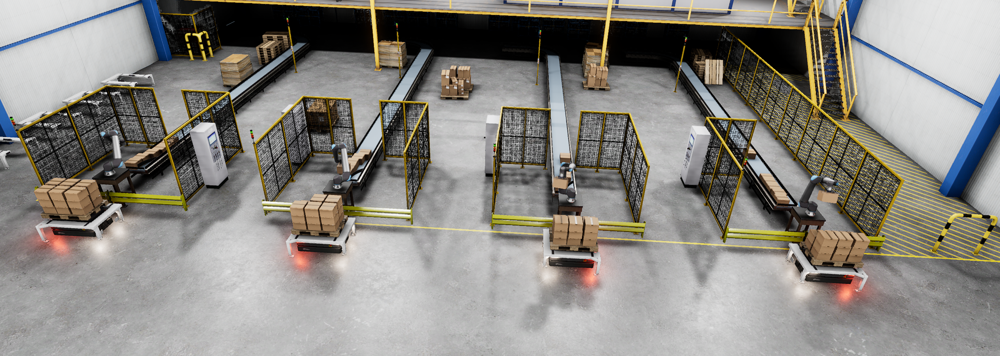
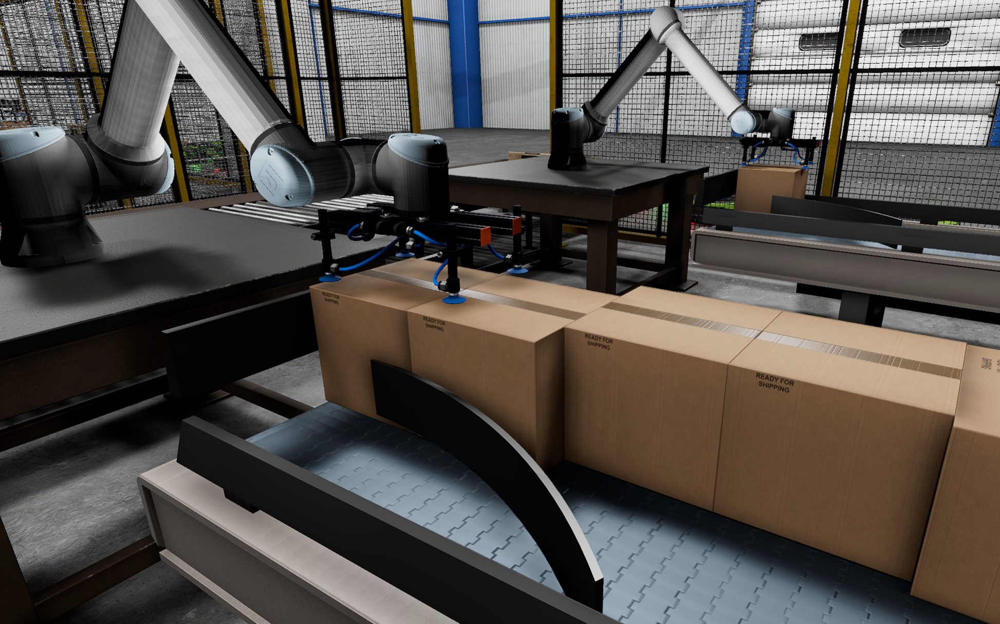
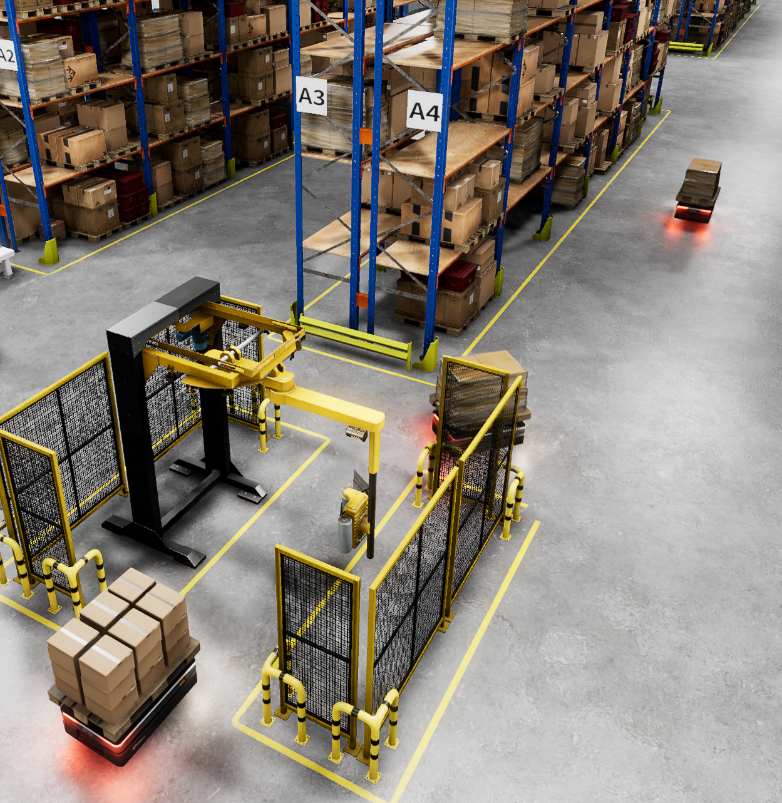
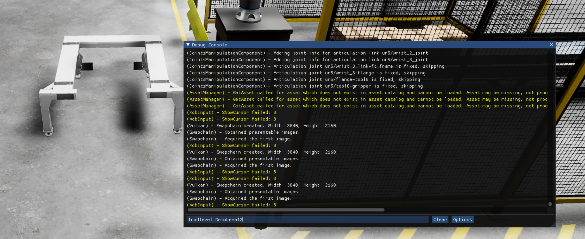

# Robotized fulfillment center

An [Open 3D Engine (O3DE)]((https://www.o3de.org/)) multi-robot demo.

## The project

This project demonstrates O3DE use for a complex robotic simulation through integration with modern ROS 2 stacks: nav2 and MoveIt2.
You can learn more about the features of O3DE for robotics and how to get started in [O3DE documentation](https://www.docs.o3de.org/docs/user-guide/interactivity/).

### Levels
- **DemoLevel1**: 30x100 meters scene with 4 conveyor belts, and 4 robotic arms. Suitable for 4-8 AMRs.
- **DemoLevel2**: 90x100 meters, three times larger, and 12 robotic arms, suitable for 12-24 AMRs.
- **RobotsSuperShot**: a level showcasing 3D models, with several robots, a human, and a forklift. Some robots are not equipped with all components yet, but you are welcome to try and make them work!
- **RobotImportLevel**: a small enclosed space with a table, good for [importing your own robot](https://docs.o3de.org/docs/user-guide/interactivity/robotics/importing-robot/).
- **DemoStereo**: a level showcasing HIL setup with AMD KRIA and stereo cameras. Visit [KRIA depth demo](https://github.com/RobotecAI/kria_depth_demo) for more information.

### Detailed description
UR20 robot arms controlled by MoveIt2 with [pilz_industrial_motion_planner](https://moveit.picknik.ai/humble/doc/examples/pilz_industrial_motion_planner/pilz_industrial_motion_planner.html?highlight=pilz#pilz-industrial-motion-planner).
Boxes are supplied by conveyor belts, which are implemented through spawning when below a certain number in an area.
UR20 arms are placing boxes based on a ground truth vision system, which means they look at the scene and that there is no error in pose measurement.
UR20 arms start working as soon as an immobile pallet is detected in their load area and will load a configurable number of boxes (up to 18, by default 18) on each pallet.

Pallets are moved around by robots modeled after OTTO 600.
Note that these AMRs do not use the software of real OTTO 600 and do not have the same sensors.
They can navigate thanks to front/back lidar sensors and operate cargo lifts.
OTTO 600 robots have assigned task loops, which are loading, wrapping, and delivering cargo to the other end of the warehouse.
They use a nav2 action server to realize their paths, and also a custom path follow solution for docking and unloading (for simplicity).
Note that robots follow their task independently but see and avoid each other and people walking around.
On the other hand, human workers don't see robots, as they use navigation through a Gem and only consider static scene objects.

### How does it look like





### The project includes
- **Scenery** initially created using a [Warehouse project template](https://www.docs.o3de.org/docs/user-guide/interactivity/robotics/project-configuration/#ros-2-project-templates), but many new models have been added.
- **Robotic Arms** imported using [URDF description](https://github.com/UniversalRobots/Universal_Robots_ROS2_Description) provided by Universal Robotics for their UR20 collaborative robot. The prefabs are available in a separate Gem.
- **AMRs** instantiated prefabs of OTTO600 and OTTO1500 robots from [OTTO Motors](https://ottomotors.com/).
- **Boxes** that are transported using conveyor belts from [Warehouse Automation Gem](https://github.com/o3de/o3de-extras/tree/development/Gems/WarehouseAutomation) and palletized.

## Requirements

### Platforms
The project runs on Ubuntu 24.04 with ROS 2 Jazzy.

💡 ***Note:*** This demo is **not supported on Windows!**

### Hardware
The demo is rather demanding, as it aims to show what is possible. Minimum specs are not determined, but we ran it on:
- AMD Radeon RX 6800 / NVIDIA GeForce RTX 3070 GPU (8 GB).
- AMD Ryzen 9 5900HX CPU / Intel i7-11800H.
- 64 GB RAM.

For more FPS, a larger scene, and more robots, we used:
- AMD Radeon RX 7900 XT / NVIDIA RTX 3080 Ti (or better) GPU (16 GB).
- AMD Ryzen 9 7950X / Intel i7-12900KF (24 cores) CPU.
- 64 GB RAM.

## Docker container environment

Follow the instructions in [./Docker/README](./Docker/README.md) file to build and run the project using *docker* virtualization.

## Local Project Setup

### Clone the repository

Clone the repository and set the working directory variable used throughout this guide:
```bash
git clone https://github.com/RobotecAI/ROSCon2023Demo.git
cd ROSCon2023Demo
export RC2023_WORKDIR=$(pwd)
```

### ROS 2 middleware
This project should be used with the `rmw_cyclonedds_cpp` as the ROS 2 middleware.
[MoveIt2 does not recommend usage of the default RMW](https://moveit.picknik.ai/main/doc/tutorials/getting_started/getting_started.html#switch-to-cyclone-dds) and as it is a part of this project using the default RMW will not work.

Install the CycloneDDS RMW by installing its package:
```bash
sudo apt install ros-${ROS_DISTRO}-rmw-cyclonedds-cpp
```
After the installation add this command to your `.bashrc` or equivalent file.
```bash
export RMW_IMPLEMENTATION=rmw_cyclonedds_cpp
```
This will change the default RMW implementation to CycloneDDS.
Source your new configuration:
```bash
source ~/.bashrc
```
> ***Note:*** The ROS2 daemon may need to be restarted to use the CycloneDDS RMW. Use `ros2 daemon stop` and `ros2 daemon start` to restart the daemon.

### O3DE
1. Refer to the [O3DE System Requirements](https://www.o3de.org/docs/welcome-guide/requirements/) documentation to make sure that the system/hardware requirements are met.
2. This project was tested on O3DE 2605.0. Download and install the SDK package:
```bash
wget -O /tmp/o3de_2605_0.deb https://o3debinaries.org/main/Latest/Linux/o3de_2605_0.deb
sudo apt install /tmp/o3de_2605_0.deb
```
3. Initialize the Python environment and register the engine:
```bash
/opt/O3DE/26.05/python/get_python.sh
/opt/O3DE/26.05/scripts/o3de.sh register --this-engine
```

Install `git-lfs` (required for asset submodules that store meshes and textures via Git LFS):
```bash
sudo apt install git-lfs
```

Initialize the git submodules (this fetches the Gems in `gems/`):
```bash
cd ${RC2023_WORKDIR}
git submodule update --init --recursive
git submodule foreach 'git lfs install && git lfs pull'
```

### ROS 2 Gem and other Gems
This project uses canonical simulation Gems from the [o3de-extras](https://github.com/o3de/o3de-extras) repository:
`LevelGeoreferencing`, `ROS2`, `ROS2Controllers`, `ROS2RobotImporter`, `ROS2Sensors`, `SimulationInterfaces`, `WarehouseAssets`, `WarehouseAutomation`.

These Gems are downloaded via the `o3de.sh` script from the canonical O3DE Gem repository. The versions below were tested with this project; newer versions may also work:
```bash
/opt/O3DE/26.05/scripts/o3de.sh register --repo-uri https://canonical.o3de.org
/opt/O3DE/26.05/scripts/o3de.sh download --gem-name LevelGeoreferencing==1.0.0
/opt/O3DE/26.05/scripts/o3de.sh download --gem-name ROS2==4.2.0
/opt/O3DE/26.05/scripts/o3de.sh download --gem-name ROS2Controllers==1.1.0
/opt/O3DE/26.05/scripts/o3de.sh download --gem-name ROS2RobotImporter==1.1.0
/opt/O3DE/26.05/scripts/o3de.sh download --gem-name ROS2Sensors==1.0.1
/opt/O3DE/26.05/scripts/o3de.sh download --gem-name SimulationInterfaces==2.2.0
/opt/O3DE/26.05/scripts/o3de.sh download --gem-name WarehouseAssets==2.0.4
/opt/O3DE/26.05/scripts/o3de.sh download --gem-name WarehouseAutomation==2.0.1
```

It also uses multiple open-source Gems prepared primarily for this demo:
- [HumanWorker Gem](https://github.com/RobotecAI/o3de-humanworker-gem)
- [UR10 and UR20 Robots Gem](https://github.com/RobotecAI/o3de-ur-robots-gem)
- [OTTO 600 and OTTO 1500 Robots Gem](https://github.com/RobotecAI/o3de-otto-robots-gem)
- [Additional warehouse assets](https://github.com/RobotecAI/robotec-warehouse-assets)
- [Additional generic assets](https://github.com/RobotecAI/robotec-generic-assets)

These Gems are included as git submodules and are fetched by the `git submodule update` command above.

To learn more about how the Gem works check out the [Concepts and Structures](https://www.docs.o3de.org/docs/user-guide/interactivity/robotics/concepts-and-components-overview/).

Note that the Gem instructions include the installation of ROS 2 with some additional packages.

The Gems are open to your contributions!

### ROS 2 packages
Make sure to install the necessary ROS 2 packages.
```bash
sudo apt install ros-${ROS_DISTRO}-ackermann-msgs ros-${ROS_DISTRO}-control-toolbox ros-${ROS_DISTRO}-nav-msgs ros-${ROS_DISTRO}-vision-msgs ros-${ROS_DISTRO}-ur-msgs ros-${ROS_DISTRO}-moveit-servo ros-${ROS_DISTRO}-moveit-visual-tools ros-${ROS_DISTRO}-moveit ros-${ROS_DISTRO}-pilz-industrial-motion-planner ros-${ROS_DISTRO}-controller-manager ros-${ROS_DISTRO}-ur-client-library ros-${ROS_DISTRO}-nav2-common ros-${ROS_DISTRO}-navigation2 libopencv-dev ros-${ROS_DISTRO}-nav2-map-server ros-${ROS_DISTRO}-simulation-interfaces ros-${ROS_DISTRO}-geometric-shapes ros-${ROS_DISTRO}-random-numbers
```

### Project
You need to build and source the ROS 2 workspace first as it contains custom messages that the simulator also uses.

```bash
cd ${RC2023_WORKDIR}/ros2_ws
colcon build --symlink-install
source install/setup.bash # adjust to your shell 
```
The source command needs to be done in the same console where you build and run O3DE.

Make sure the following tools and libraries are installed on your system (they are required to build the project):
```bash
sudo apt install ninja-build libunwind-dev libxcb-xkb-dev libxcb-xfixes0-dev libxkbcommon-x11-dev libxcb-xinput-dev
```

```bash
cd ${RC2023_WORKDIR}/Project
cmake -B build/linux -G "Ninja Multi-Config" -DLY_DISABLE_TEST_MODULES=ON -DLY_STRIP_DEBUG_SYMBOLS=ON
cmake --build build/linux --config profile --target ROSCon2023Demo ROSCon2023Demo.Assets ROSCon2023Demo.GameLauncher
```
You can now run the project Editor with:
```bash
/opt/O3DE/26.05/bin/Linux/profile/Default/Editor --project-path ${RC2023_WORKDIR}/Project
```

or you can launch the simulation directly:
```bash
cd ${RC2023_WORKDIR}/Project
./build/linux/bin/profile/ROSCon2023Demo.GameLauncher -r_fullscreen=true -bg_ConnectToAssetProcessor=0 -r_width=1920 -r_height=1080 +LoadLevel=demolevel1
```

All parameters are optional — `demolevel1` is loaded by default:
- `-r_fullscreen=true` — run in fullscreen mode
- `-bg_ConnectToAssetProcessor=0` — skip connecting to the Asset Processor (recommended for release-like runs)
- `-r_width=1920 -r_height=1080` — set the resolution
- `+LoadLevel=demolevel1` — level to load on startup; alternatives are `demolevel2`, `RobotsSuperShot`, `RobotImportLevel`, `DemoStereo`

### Building the release package (optional)

To build a release package with all use export script available in o3de.
Release package is a standalone package that can be run on any computer without the need to build the project, it is 
a self-contained package with all assets and binaries.
To learn more on exporting game launcher see [O3DE documentation](https://www.docs.o3de.org/docs/user-guide/packaging/project-export/project-export-pc/).

To build the game launcher and bundle assets:
```bash
source ${RC2023_WORKDIR}/ros2_ws/install/setup.bash
/opt/O3DE/26.05/scripts/o3de.sh export-project -es ExportScripts/export_source_built_project.py \
    --project-path ${RC2023_WORKDIR}/Project \
    --seedlist ${RC2023_WORKDIR}/Project/AssetBundling/SeedLists/demo.seed \
    --fail-on-asset-errors \
    -noserver \
    -out ${RC2023_WORKDIR}/Project/build/release \
    --no-unified-launcher
```
The build package is available here:
```
${RC2023_WORKDIR}/Project/build/release 
└── ROSCon2023DemoGamePackage
    ├── Cache
    │   └── linux
    │       ├── engine_linux.pak
    │       └── game_linux.pak
    ├── libPhysXGpu_64.so
    ├── libVkLayer_khronos_validation.so
    ├── project.json
    ├── Registry
    │   └── IgnoreAssetProcessor.profile.setregpatch
    ├── ROSCon2023Demo.GameLauncher
    └── VkLayer_khronos_validation.json
```
Please consider copying ROS 2 workspace to the release package. The ROS 2 workspace is required to run the ROS 2 nodes, since GameLauncher does not contain dynamic libraries required by ROS 2.

```bash
# Consider copying ROS 2 workspace
mkdir -p ${RC2023_WORKDIR}/Project/build/release/ros2_ws/
cp -r ${RC2023_WORKDIR}/ros2_ws/src  ${RC2023_WORKDIR}/ROSCon2023Demo/Project/build/release/ros2_ws/
```

To start a released the GameLauncher simply:
```bash
cd ${RC2023_WORKDIR}/ROSCon2023Demo/ros2_ws
colcon build --symlink-install
${RC2023_WORKDIR}/ros2_ws/install/setup.bash
${RC2023_WORKDIR}/Project/build/release/ROSCon2023DemoGamePackage/ROSCon2023Demo.GameLauncher
```

This package can be moved to cloud instance or other computer.

## Running the simulation

Open the level: `DemoLevel1.prefab`.
Launch the O3DE simulation by clicking `CTRL + G` or by clicking the launch arrow next to the `Play Controls` in the top right corner.
Now go to the `ros2_ws` folder and run the all ros2 packages.
```bash
cd ${RC2023_WORKDIR}/ros2_ws
source install/setup.bash
ros2 launch roscon2023_demo ROSCon2023Demo.launch.py
```
In a few seconds, the robots should spawn and start moving.
For a more in-depth explanation see the [ros2_ws/README.md](ros2_ws/README.md).
> **_NOTE:_** By default, 4 robots are spawned. To change the number of robots see [#changing-robots-amount paragraph](ros2_ws/README.md#changing-robots-amount).

You can watch the simulation of a smaller warehouse `DemoLevel1.prefab` from one out of six predefined viewpoints: the first four are set towards four different loading areas and the remaining two show the wrapping station and the unloading area respectively. The viewpoints can be changed using `[1]` to `[6]` keys on the keyboard. Simulation of a large warehouse `DemoLevel2.prefab` is observed from the fly camera, which can freely move around the scene. Use `[w]`, `[s]`, `[a]`, and `[d]` keys and a mouse to change a camera position.

## Simulation of a large scene with 36 robots

### Limitations
We experienced a problem with scale and ROS 2 launch. The standard approach of a single launch file might cause the following issues:
- Some robots were not spawned.
- Some Nav2 stacks were created in a state in which they were not operational.

The problem is communication in ROS 2 which was temporarily saturated.
The number of mechanisms in ROS 2 nodes depends on the assumption that QoS for services is reliable.
It could be not true for a saturated system.
In other words, this demo is a great efficiency test for your DDS.
To counteract the impact of those limitations, we launch a system with bash scripts, and every robot uses a separate `screen` session.

### Prerequisites
1. **Two machines** connected in a 2.5 Gbps local network, ideally point-to-point.
Specification we used:
- Intel 13th Gen Core i9-13900K
- NVIDIA GeForce RTX 4080
- 64 GB of DDR4 RAM

2. Correctly set ROS 2 domain to establish the communication between two machines.
We used CycloneDDS with the following config:
```
<?xml version="1.0" encoding="UTF-8" ?>
<CycloneDDS xmlns="https://cdds.io/config" xmlns:xsi="http://www.w3.org/2001/XMLSchema-instance" xsi:schemaLocation="https://cdds.io/config
https://raw.githubusercontent.com/eclipse-cyclonedds/cyclonedds/master/etc/cyclonedds.xsd">
    <Domain id="any">
        <Internal>
		<SocketReceiveBufferSize min="10MB" max="default" />
        </Internal>
    	<Discovery>
      		<ParticipantIndex>auto</ParticipantIndex>
      		<MaxAutoParticipantIndex>1000</MaxAutoParticipantIndex>
    	</Discovery>
    </Domain>
</CycloneDDS>
```
Please refer to [DDS tuning information](https://docs.ros.org/en/jazzy/How-To-Guides/DDS-tuning.html#cyclone-dds-tuning) to learn more.

### Running simulation 
1. On **Machine 1** start GameLauncher, without connecting to `AssetProcess`, with resolution of your choice (we set it to 2.5K to achieve high frame rate) and in fullscreen mode:
    ```bash
    ./ROSCon2023.GameLaucher -r_fullscreen=false -bg_ConnectToAssetProcessor=0 -r_width=2560 -r_height=1440 -r_resolutionMode=1
    ```

2. On **Machine 1**, with GameLauncher started, switch level to `DemoLevel2` by hitting `Home` key and entering command `LoadLevel demolevel2` in Debug Console.
   

3. On **Machine 2** build ROS2 workspace (no need to build o3de project), source workspace:
   ```bash
   cd ROSCon2023Demo/ros2_ws
   colcon build --symlink-install
   source ./install/setup.bash
   ```
4. On **Machine 2** make sure you have the `screen` binary installed as it is used by bash launch scripts:
   ```bash
   sudo apt install screen
   ```
   Then start two scripts that will bring all ROS 2 software stacks:
   ```bash
    ./src/roscon2023_demo/bash/spawn.sh
    ./src/roscon2023_demo/bash/start_fleet.sh
    ```
    The `spawn.sh` script starts MoveIt2 move groups, palletization drivers and spawns all AMRs one by one.
    The second script, `start_fleet.sh`, creates multiple screen sessions to run AMR navigation.

5. To stop the demo, simply close all `screen` sessions on **Machine 2**:   
    ```bash
    killall screen
    ```

### Troubleshooting
If your simulation does not work as intended, please first make sure that you sourced the ROS 2 workspace before running the project.

Please also refer to the common [Troubleshooting Guide](https://docs.o3de.org/docs/user-guide/interactivity/robotics/troubleshooting/).

## Release notes

### ROSCon2023Demo 4.0.0 for O3DE 2605.x (SDK) and ROS 2 Jazzy
Changes compared to 3.0.1
- switch to O3DE SDK
- updated code to the new API in ROS 2 Gem and other canonical gems in O3DE 2605.0
- updated code to the new API in ROS 2 Jazzy (Nav2 package)
- updated spawning mechanisms to SimulationInterfaces
- made a flat copy of UR MoveIt2, to avoid issues with building UR ROS 2 Driver

### ROSCon2023Demo 3.0.1 for O3DE 2505.x
Changes compared to 3.0.0
- fix branch names in Docker scripts

### ROSCon2023Demo 3.0.0 for O3DE 2505.x
Changes compared to 2.0.0
- updated demo the newest available version of O3DE and ROS 2 Gem

### ROSCon2023Demo 2.0.1 for O3DE 2409.x
Changes compared to 2.0.0:
- updated UR ROS2 Driver (external) submodule

### ROSCon2023Demo 2.0.0 for O3DE 2409.x
Changes compared to 1.0.1:
- updated demo the newest available version of O3DE and ROS 2 Gem
- added docker support (sample Dockerfiles and additional README)
- added **DemoStereo** level showcasing HIL setup with AMD KRIA and stereo cameras (this level was used during ROSCon 2024 conference)
- moved multiple assets to standalone repositories to simplify their usage among different projects
- multiple scene optimizations
- updated README

### ROSCon2023Demo 1.0.1 for O3DE 2310.x
Changes compared to 1.0.0:
- enforced versions of dependencies (HumanWorker, OTTORobots, URRobots)
- updated UR ROS2 Driver (external) submodule
- updated README

### ROSCon2023Demo 1.0.0 for O3DE 2310.x
Initial release of the demo, prepared around ROSCon 2023 conference.

## Acknowledgments

This demo project was originally developed by [Robotec.ai](https://robotec.ai) in cooperation with [AWS Game Tech](https://aws.amazon.com/gametech/) and [AWS RoboMaker](https://aws.amazon.com/robomaker/).
